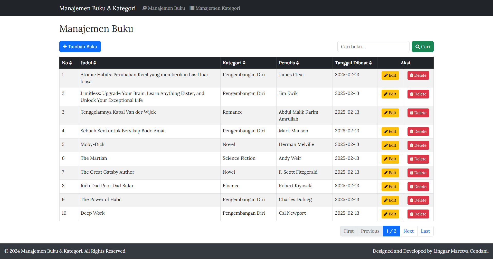

# Manajemen Buku & Kategori (Django + PostgreSQL)

## 📌 Project Overview
This is a simple Django web application for managing a list of books stored in a **PostgreSQL database**. The application features:

### 1️⃣ Book Management
✅ **Book Listing** (Displays all books in a table)  
✅ **Search** (Filter books by title)  
✅ **Sorting** (Click column headers to sort ascending/descending)  
✅ **Pagination** (Navigate through book records in pages)  

### 2️⃣ Category Management
✅ **Category Listing** (Displays all categories in a table)  
✅ **Search** (Filter categories by category name)  
✅ **Sorting** (Click column headers to sort ascending/descending)  
✅ **Pagination** (Navigate through category records in pages)

---

## 📸 Preview / Screenshots
Here are some screenshots of the application:



---

## 🚀 Installation & Setup

### 1️⃣ Clone the Repository
```bash
git clone https://gitlab.com/personal-projects6033123/manajemen-buku-kategori.git
cd manajemen-buku-kategori
```

### 2️⃣ Create a Virtual Environment
```bash
python -m venv env
source env/bin/activate  # On Windows use: env\Scripts\activate
```

### 3️⃣ Install Dependencies
```bash
pip install -r requirements.txt
```

### 4️⃣ Configure PostgreSQL Database
Update `settings.py` with your PostgreSQL credentials:
```python
DATABASES = {
    'default': {
        'ENGINE': 'django.db.backends.postgresql',
        'NAME': 'your_db_name',
        'USER': 'your_db_user',
        'PASSWORD': 'your_db_password',
        'HOST': 'localhost',
        'PORT': '5432',
    }
}
```

### 5️⃣ Run Migrations
```bash
python manage.py migrate
```

### 6️⃣ Create a Superuser (Optional for Admin Access)
```bash
python manage.py createsuperuser
```

### 7️⃣ Run the Development Server
```bash
python manage.py runserver
```
Open **http://127.0.0.1:8000/** in your browser. 🚀

---

## Database Restoration (Optional)

If you want to restore the PostgreSQL database from `database.sql`, follow these steps:

### 🖥️ Windows
1. Open **Command Prompt** (`cmd`) as Administrator.
2. Navigate to the PostgreSQL `bin` directory or use the full path:
   ```sh
   "C:\Program Files\PostgreSQL\15\bin\psql.exe" -U your_db_user -h localhost -d your_new_db_name -f database.sql
   ```
3. Enter your PostgreSQL password if prompted.

### 🐧 Linux / macOS
1. Open a terminal.
2. Run the following command:
   ```sh
   psql -U your_db_user -h localhost -d your_new_db_name -f database.sql
   ```
3. Enter your PostgreSQL password if prompted.

---

## 🖥️ Features
- **📚 Book Listing:** Displays books stored in the database
- **🔍 Search:** Search by title or author
- **📊 Sorting:** Clickable column headers for sorting
- **📑 Pagination:** Paginate through book records

---

## 🛠️ Technologies Used
- **Python** (Programming Language)
- **Django** (Python Web Framework)
- **PostgreSQL** (Relational Database)
- **Bootstrap** (For UI Styling)
- **HTML, CSS** (Frontend)

---

## 📄 License
This project is licensed under the **MIT License**.